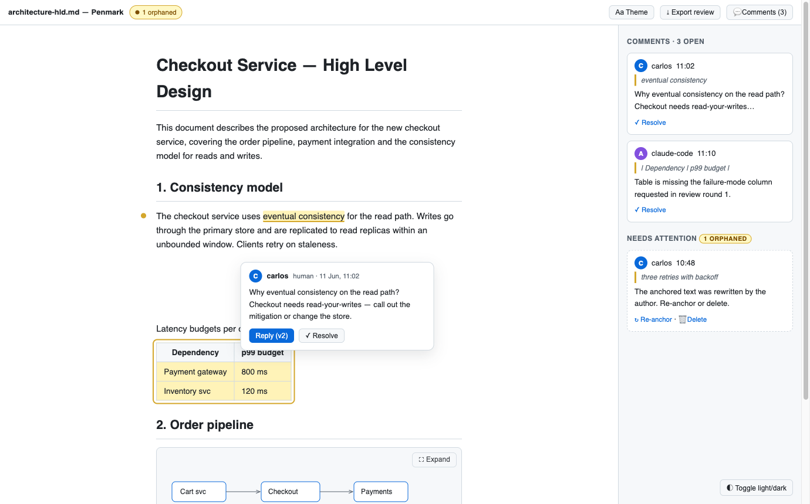
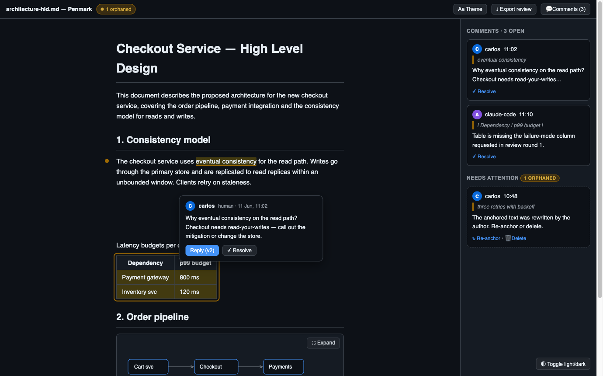

# Architecture

Penmark is a single VS Code extension with a platform-agnostic core, built for a slim bundle, lazy activation, and incremental rendering. This page describes the shipped architecture; for the settings surface see [configuration.md](configuration.md), and for the decisions of record see the [ADRs](adrs/).

## Overview

A custom WebviewPanel preview ([ADR 0001](adrs/0001-custom-webview-panel-architecture.md)) renders markdown parsed host-side by markdown-it with per-block source offsets ([ADR 0005](adrs/0005-markdown-it-render-pipeline.md)), shipped to the webview over a versioned message protocol and applied incrementally with morphdom. The host stays slim and lazily loads the markdown-it render stack, highlight.js, and mermaid only when needed (activation under 50 ms, core VSIX under 1 MiB). Sanitization is DOMPurify in the webview, behind a strict nonce CSP.

Comments are stored single-file — invisible `pmk:` HTML-comment anchors in the text plus a hidden review block at the end of the same document ([ADR 0002](adrs/0002-single-file-comment-storage.md)), using span-wrapping marker pairs with a degradation ladder plus block/range anchors ([ADR 0006](adrs/0006-span-anchor-wrapping-with-degradation-ladder.md), superseding [ADR 0003](adrs/0003-anchor-model-and-encoding.md)). Resolving a comment deletes it; git history is the audit trail. The marker grammar is frozen in [`spec/penmark-format.md`](../spec/penmark-format.md), and CI proves it survives Prettier and markdownlint.

## Concept

The reviewing UI, in light and dark:





## Layout

A single package with a lint-enforced boundary ([ADR 0001](adrs/0001-custom-webview-panel-architecture.md)): `src/core` has zero `vscode` imports, so a future self-hosted web app could reuse the same engine and format.

```
src/
  core/        zero vscode imports (enforced by ESLint + Node-only tests)
    render/    markdown-it pipeline, source-offset stamping, sanitize
    comments/  format parser/serializer, anchor placement, reconcile, IDs
    protocol/  versioned message types shared with the webview
  vscode/      activation, commands, preview panel manager, WorkspaceEdit ops, settings, watchers
  webview/     separate esbuild entry: highlights, comment box, drawer, find fallback, mermaid loader, lightbox, theme
```

## Data flow

1. `penmark.openPreview` renders the active markdown file in a singleton panel per editor column.
2. Host: parse (markdown-it), stamp a source offset on each block, extract anchors and entries, sanitize (DOMPurify), then post a `render` message to the webview.
3. Document changes (debounced ~300 ms) re-render incrementally in the webview (morphdom, not a wholesale `innerHTML` replace; diagrams re-render only if their source changed).
4. Selecting text in the preview maps the selection to source offsets via the offset attributes, snapping to a safe range; the host computes anchor placement (an AST-safety check) and applies a `WorkspaceEdit`.
5. Comment highlights render as a tint plus a gutter dot; the drawer lists all comments and the needs-attention bucket, with jump-to.
6. Scroll sync runs over the same offset map, both directions, gated by `penmark.scrollSync`.

## Webview lifecycle and security

A single reusable panel, with no `retainContextWhenHidden` — state is restored via `getState`/`setState`. The CSP is `default-src 'none'`; script and style by nonce only; images from workspace roots and `data:` only. `localResourceRoots` is limited to the extension bundle and the workspace folder. No network access, no telemetry, all assets bundled (no CDN).

## Adaptive review surface

Settings and Comments are two on-demand side panels that share the same persistent preview root — opening or closing either never re-renders the document, only toggles body-state attributes (`data-pmk-settings-open` / `data-pmk-drawer-open`) that drive layout purely through CSS. Only one panel is open at a time. Geometry is responsive: at 1050px or wider an open Comments panel reserves 342px of layout space beside the document — Settings always overlays, at any width; below 1050px both panels overlay without reserving space; below 700px the open panel takes `calc(100vw - 24px)`.

A small surface coordinator in `src/webview/keyboard.ts` tracks every open Penmark-owned panel/popover as a stack (`registerPenmarkSurface`/`closeTopmostPenmarkSurface`), so `Esc` always closes only the topmost surface and restores focus to the control that opened it — resolving the opener even after the topbar is rebuilt (`data-pmk-topbar-control` matching). Native VS Code dialogs and the browser's own Find widget (`enableFindWidget: true` on both preview entry paths) are outside this stack and keep their own authoritative cancellation.

Native Find works in stock VS Code but is incomplete in Cursor and Antigravity, so Penmark also provides a webview-native Search surface ([ADR 0008](adrs/0008-in-preview-find-fallback.md)). The top-bar control and `penmark.find` command open a transient text-node highlighter under the preview root. It leaves selection and persisted Markdown unchanged, does not decorate across comment-anchor wrappers, clears its marks before morphdom reconciles, then reapplies an open query. Work is bounded at 500 matches, 10,000 text nodes, or 1,000,000 text characters; a capped result shows `N+` and is logged.

The Settings panel itself is narrowed to the six settings most relevant while previewing (theme, preset, text size, content width, code wrapping, comment-highlight intensity); everything else — including line height — is one click away via a fixed **Open all Penmark settings** link: the host runs `workbench.action.openSettings` filtered to `penmark` and ignores any webview-supplied data (no product URI scheme involved, so it works identically in VS Code, Cursor, and Antigravity). A `readingMetrics` helper renders a compact word-count/reading-time line beside the document title.

`prefers-reduced-motion: reduce` (via `src/webview/motion.ts`) zeroes Penmark-owned panel, control, and comment-highlight transition durations and switches the comment-jump `scrollIntoView` from `smooth` to `auto`; it does not affect native Find or dialog motion.

## Mermaid

Mermaid is lazily imported only when a `mermaid` fence exists, rendered with `securityLevel: strict` and an `IntersectionObserver` for many-diagram documents; a failed diagram shows its source and error without breaking the page. Because mermaid emits styling that a strict nonce CSP would block, Penmark re-applies mermaid's intended inline styles via the CSSOM, scoped to the SVG, through a property allowlist (see the [ADR 0005](adrs/0005-markdown-it-render-pipeline.md) amendment).

## Export (HTML / PDF)

Export snapshots the preview instead of re-rendering ([ADR 0007](adrs/0007-export-via-preview-capture.md)): the host posts `exportCapture`, the webview force-renders every mermaid diagram (bypassing the lazy observer), strips preview chrome and comment-highlight markup from a clone, and posts the sanitized DOM back. The host wraps it into a self-contained, JavaScript-free HTML file — stylesheets inlined, theme and typography pinned, local images embedded as `data:` URIs, a defense-in-depth CSP meta — so the export equals the preview by construction. PDF prints that file with a system-installed Chromium-based browser (`--headless --print-to-pdf`, auto-discovered or `penmark.export.chromiumPath`), with `@page` size from `penmark.export.pdfPageSize` and print CSS that keeps code blocks, tables, and diagrams whole across pages. No print engine is bundled; without a local browser the command degrades to the HTML export.

## Performance budgets

- Core VSIX under 1 MiB (the mermaid chunk is excluded and lazy).
- Activation under 50 ms (`onCommand`/`onWebviewPanel` only — no `onLanguage`, no `workspaceContains`).
- First render under 300 ms for a 1k-line document; re-render preserves scroll position with no diagram flicker.
- A 10k-line document with 200 comments stays interactive.

These are enforced in CI by a bundle-size gate and a performance test layer.

## Error handling

- A corrupted or unparseable review block still renders the preview; an attention chip and the drawer surface "needs attention" with a raw view, and Penmark never auto-rewrites without user action.
- All comment mutations go through `WorkspaceEdit`, so undo always works and there are no direct file writes while the document is open in an editor.
- Reconcile is idempotent and read-only by default, because single-file storage means external edits are normal.
- Mermaid and highlight failures degrade per element, logged to an output channel (no console spam, no toasts unless actionable).

## Decisions of record

| ADR | Decision |
| --- | --- |
| [0001](adrs/0001-custom-webview-panel-architecture.md) | Custom WebviewPanel preview and the core boundary |
| [0002](adrs/0002-single-file-comment-storage.md) | Single-file comment storage, resolve = delete |
| [0003](adrs/0003-anchor-model-and-encoding.md) | Anchor model and encoding (superseded by 0006) |
| [0004](adrs/0004-name-penmark-and-dual-publishing.md) | Name "Penmark"; distribution and publishing |
| [0005](adrs/0005-markdown-it-render-pipeline.md) | markdown-it render pipeline and source offsets |
| [0006](adrs/0006-span-anchor-wrapping-with-degradation-ladder.md) | Span-anchor wrapping pairs and the degradation ladder |
| [0007](adrs/0007-export-via-preview-capture.md) | HTML/PDF export via preview-DOM capture; PDF via system Chromium |
| [0008](adrs/0008-in-preview-find-fallback.md) | In-preview Find fallback for editor forks |
