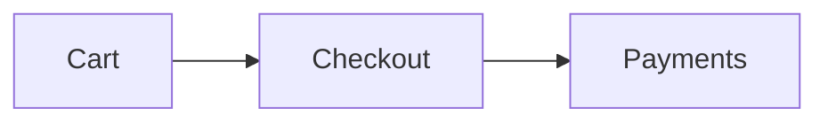

# Release smoke checklist — Penmark v0.1.0 (Reading MVP)

The v0.1 manual cross-IDE gate (design §7), run against the **sideloaded VSIX** instead of a marketplace install (local-first, ADR 0004 amendment). Automated CI already covers unit/jsdom/Playwright/extension-matrix; this checklist verifies the real rendered experience in each IDE, which no headless harness covers.

Run it once per IDE after every release. v0.1 is **preview-only** — there is no comment authoring yet (that is v0.5), so nothing here exercises commenting.

## 0. Get the VSIX

Download `penmark-0.1.0.vsix` from the [GitHub Release](https://github.com/carlosboeing/penmark/releases/tag/v0.1.0) (built and attached by `.github/workflows/release.yml` on the `v0.1.0` tag).

## 1. Install (per IDE)

Each IDE is a VS Code fork with its own CLI binary. Use the UI path if the CLI is not on `PATH`.

| IDE | CLI install | UI install |
|---|---|---|
| VS Code | `code --install-extension penmark-0.1.0.vsix` | Extensions view → `...` menu → **Install from VSIX…** |
| Cursor | `cursor --install-extension penmark-0.1.0.vsix` | Extensions view → `...` → **Install from VSIX…** |
| Antigravity | `antigravity --install-extension penmark-0.1.0.vsix` | Extensions view → `...` → **Install from VSIX…** |

Reload the window after install. Compatibility floor is `engines.vscode ^1.105.0` (Cursor 1.105 base, Antigravity 1.107).

## 2. Test document

Open a markdown file that exercises every feature. Paste this into a scratch `.md` (or use any rich doc):

````markdown
# Smoke test

A paragraph with a [link](https://example.com), `inline code`, **bold**, and ~~strike~~.

## Lists and tasks
- one
- two
- [x] done
- [ ] todo

## Table
| Feature | State |
|---|---|
| themes | light/dark/auto |
| mermaid | lazy |

## Code
```ts
function greet(name: string): string {
  return `hi ${name}`;
}
```

## Diagram


> A blockquote, for good measure.
````

For the scroll-sync and large-doc checks, also open a long document (a few hundred lines — any real design doc works).

## 3. Checks (repeat for VS Code, Cursor, Antigravity)

Run **Penmark: Open Preview** (Command Palette) with the test doc focused.

- [ ] **Command + panel** — `Penmark: Open Preview` appears in the palette; invoking it opens a preview panel beside the editor.
- [ ] **GFM rendering** — headings, lists, task-list checkboxes, the table, blockquote, links, inline/bold/strike all render correctly.
- [ ] **Syntax highlighting** — the ` ```ts ` block shows colored tokens (highlight.js loaded).
- [ ] **Mermaid** — the flowchart renders as an SVG when scrolled into view; clicking **Expand** opens a lightbox; pan/zoom works; **Esc** closes it. A deliberately broken diagram (optional) shows an error + its source without breaking the page.
- [ ] **Themes — auto** — with `penmark.theme` at its default (`auto`), flip the IDE between a light and a dark theme; the preview follows.
- [ ] **Themes — override** — set `penmark.theme` to `light`, then `dark`; the preview honors the setting regardless of the IDE theme.
- [ ] **Copy buttons** — hovering a code block reveals a **Copy** button; clicking it copies the exact code (paste elsewhere to confirm — no button label, newlines preserved) and briefly shows "Copied".
- [ ] **Scroll sync** (open the long doc) — with `penmark.scrollSync` on (default), scrolling the editor moves the preview and vice-versa, without oscillation/jitter. Toggling `penmark.scrollSync` off stops both directions.
- [ ] **Live re-render** — edit the source; the preview updates after a brief debounce, the scroll position is preserved, and a rendered mermaid diagram does not flicker if its source did not change.
- [ ] **Responsiveness** — on the long doc, scrolling and editing feel smooth (no visible long stalls).
- [ ] **No hidden-tab retention** — switch the preview tab to the background and back; it behaves correctly (the panel is not kept alive hidden).
- [ ] **Clean console** — open the webview devtools (**Developer: Open Webview Developer Tools**); no errors or CSP violations on open, render, theme switch, or copy.

## 4. Sign-off

| IDE | Version | Date | Result | Notes |
|---|---|---|---|---|
| VS Code | | | pass / fail | |
| Cursor | | | pass / fail | |
| Antigravity | | | pass / fail | |

A failure in any row blocks sign-off for that IDE — file an issue with the IDE/version, the step, and any console output, then re-run after the fix.
