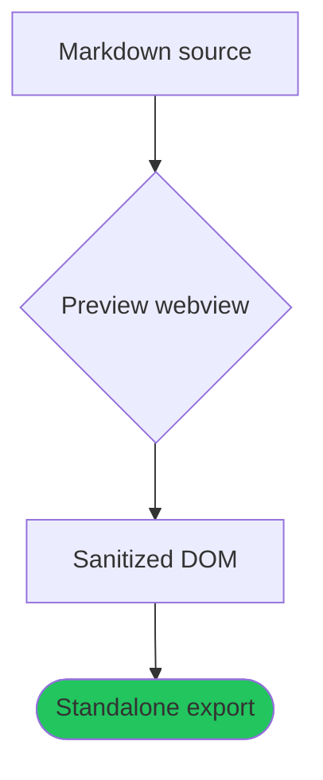

# Export Showcase

A paragraph with a [link](https://example.com), `inline code`, **bold**, _italic_, and ~~strikethrough~~ — exercising every inline token the preview themes.

## Lists

- First item
- Second item with `code`
  - Nested child item
- Third item

1. Ordered one
2. Ordered two

## Tasks

- [x] Completed task
- [ ] Open task

## Quote

> A blockquote with muted foreground, a left border, and a tinted background.

## Code

```ts
export function greet(name: string): string {
  // Token colors come from the hljs theme variables.
  const count = 42;
  return `hi ${name} (${count})`;
}
```

## Table

| Feature  | Preview | Export |
| -------- | ------- | ------ |
| Headings | yes     | yes    |
| Diagrams | yes     | yes    |
| Comments | yes     | no     |

## Diagram



## Image


---

A closing paragraph after a horizontal rule, with a footnote reference.[^1]

[^1]: The footnote text lives at the end of the document.
